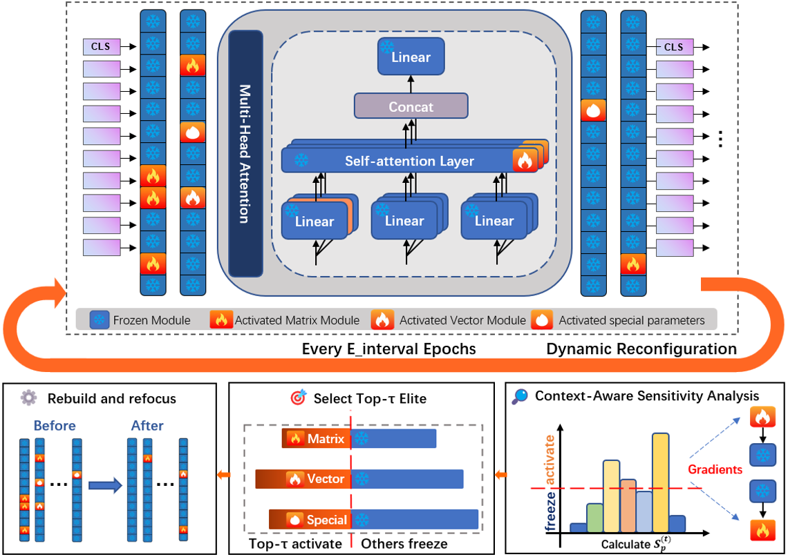
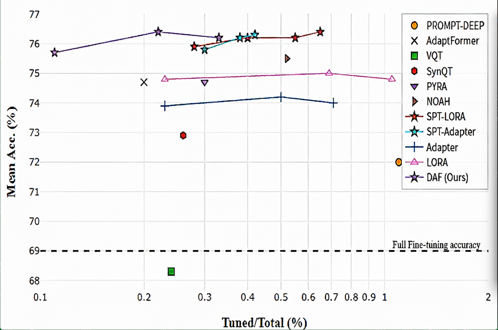

# DAF : DYNAMIC-ADAPTIVE-FINE-TUNING-OF-VISION-TRANSFORMERS
a novel dynamic reconfiguration paradigm for Parameter-Efficient Fine-Tuning (PEFT) that adaptively adjusts the trainable structure during training to achieve a great performance
> Our paper is currently under submission to ICLR 2026. The core implementation of our DAF framework is provided in dynamic_DAF.py. The full codebase will be released upon acceptance (expected around early 2026).

## Main structure

## Main Results

Our proposed DAF consistently outperforms existing state-of-the-art PEFT methods on the challenging VTAB-1k benchmark.

