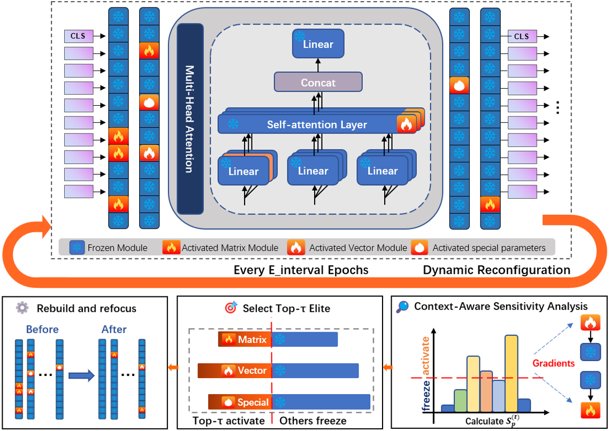

**Beyond Static Allocation: Dynamic Sensitivity-Aware Fine-Tuning for Vision Transformers**

a novel dynamic reconfiguration paradigm for Parameter-Efficient Fine-Tuning (PEFT) that adaptively adjusts the trainable structure during training to achieve a great performance

> Our paper is currently under submission to ICML2026. 
> Code will be released soon.

## Main structure

